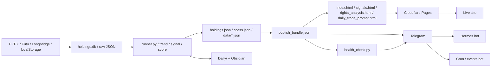

# CCASS / Market 系統地圖

> 目的：將「資料來源、refresh、頁面、Telegram、Daily note」全部對齊同一套 source of truth。
> 原則：先定 source，再定 export，再定 page，再定 Telegram，最後先講文案。

## 1. 一句講晒

呢個系統本質上分做 5 層：

1. **原始資料層**：`holdings.db`、HKEX 披露易、Futu / Longbridge cache、事件 / 公告 JSON
2. **計算層**：`runner.py`、trend / signal / backtest / score 生成
3. **發佈層**：`holdings.json`、`ccass.json`、`data/*.json`、`publish_bundle.json`
4. **展示層**：主頁、訊號頁、供配股頁、時間窗口頁、戰情室、說明書
5. **通知層**：Telegram、health check、Daily note

所有對外輸出都要盡量讀同一套 metadata，避免「Telegram 講更新，但頁面食舊 cache」。

### 主流程圖



### 你可以點樣理解

- **source**：原始資料先入 `holdings.db` 同 `data/*.json`
- **compute**：`runner.py` 同相關 script 計 trend / score / backtest
- **publish**：`publish_bundle.json` 做共用 metadata
- **display**：網站頁面只讀已發佈資料
- **notify**：Telegram 同 health check 都要讀同一份 bundle

### 超短版

```text
source
  ↓
compute
  ↓
publish_bundle.json
  ↓
pages / health_check / telegram / daily note
  ↓
Cloudflare Pages + Hermes/Cron bots
```

---

## 2. 原始資料層

### 主 source of truth

- `ccass/holdings.db`
  - 主 holdings 資料庫
  - `FATAL-002`：唔可以亂 DROP / DELETE / ALTER
  - `holdings.db` 係唯一 source of truth

### 主要外部來源

- HKEX / 披露易
  - 公告、供股、配股、事件、時間窗口
- Futu / Longbridge cache
  - 股價、量、market cap、suspended list
- localStorage
  - `watchlist.html` 自選資料只儲喺本機

---

## 3. 計算層

### 主 refresh pipeline

- `ccass/scripts/daily_refresh.sh`
  - **bounded daily refresh orchestrator**
  - 只做當日主流程；遇到 time budget / partial coverage 就停止，唔再死追尾 stock
  - 依序做：
    1. `src.runner`
    2. `daily_lp_futu.py`
    3. `generate_prices_json.py`
    4. `generate_signals_json.py`
    5. `regenerate_json.py`
    6. `build_publish_bundle.py`
    7. `gen_daily_trade_prompt.py`
    8. `cleanup_logs.py`
    9. `audit_gate.py`
    10. commit / push
- `ccass/scripts/resume_incomplete_dates.py`
  - **separate resume job**
  - 自動檢查最近 incomplete trade dates
  - 用 `resume_backfill_range.py` 補返尾段缺口，唔阻塞日常 refresh

### 重要計算模組

- `ccass/src/runner.py`
  - scrape / enrich / regenerate 的核心 runner
- `scripts/build_publish_bundle.py`
  - 生成 shared metadata bundle
- `scripts/gen_daily_trade_prompt.py`
  - 生成 `daily_trade_prompt.html`
- `scripts/health_check.py`
  - 每日健康檢查 + Telegram summary
- `scripts/cleanup_logs.py`
  - 清舊 log，避免檔案膨脹

### 趨勢 / 回測

- `ccass_trends`（legacy，日常 trend pipeline 已停用）
  - CCASS 持倉 trend 主來源
  - `d5 / d20 / d60 / d120` 由持倉歷史計出
- `data/vqc_backtest.json`
  - 成交轉勢日回測
- `data/distribution_day_backtest.json`
  - 分佈日回測
- `data/jieqi_backtest.json`
  - 節氣窗口回測

### 重要原則

- `d60 / d120` 唔夠歷史就應該係 `null`
- 唔可以用 price trend 假扮 CCASS trend
- 所有 trend / score 要先驗證再出頁面

---

## 4. 發佈層

### Canonical files

- `holdings.json`
- `ccass.json`
- `data/holdings.json`
- `data/ccass.json`
- `data/signals.json`
- `data/alerts.json`
- `data/market.json`
- `data/stock_prices.json`
- `data/publish_bundle.json`

### Shared publish bundle

- `data/publish_bundle.json`
  - 用嚟統一 Telegram / dashboard / Daily / health check
  - 由 `build_publish_bundle.py` 生成
  - 裡面要有：
    - holdings updated
    - signals updated
    - alerts updated
    - prices updated
    - backtest updated
    - publish status

### Source selection rule

- 只可以有一個 primary source
- duplicate / fallback 只可以作 fallback，且要標示
- 一旦發現 page / Telegram / notes 唔一致，先修 source / export path，再修文案

---

## 5. 展示層

### 主頁 / 訊號頁

- `index.html`
- `signals.html`

保留項目：
- `美股P/E`
- `美股 breadth`

已移除：
- 獨立 `美股訊號儀表板` page

### 供配股 / 公告解讀

- `rights_analysis.html`
  - `發行方有利度`
  - `股東短期壓力`
  - `公告後價格反應`

### 時間窗口

- `timing_analysis.html`
- `vqc_analysis.html`
- `distribution_day.html`
- `jieqi_analysis.html`

### 市場 / 資金 / 結構

- `fundflow.html`
- `gap_fvg.html`
- `history.html`
- `watchlist.html`
- `daily_trade_prompt.html`

### 說明 / 戰情室

- `guide.html`
- `docs/ccass-warroom.html`

### 顯示規則

- 頁面要標清 `更新於 / 數據來源`
- 同一個欄位，主頁同其他 page 要一致
- 唔好同一隻股喺兩頁有兩個不同口徑

---

## 6. 通知層

### Telegram 分工

- **Hermes bot**
  - 用作人手對話 / 日常交互 / 需要我跟你講嘢嘅位
  - 唔應該被 cron spam

- **Cron / events bot**
  - 用作機器通知
  - CCASS events、heartbeat、cron job、health summary

### 重要規則

- `ccass_events.yml` 類通知要去第二個 bot
- Hermes 只保留需要人回覆嘅訊息
- 所有通知內容要同 dashboard / notes 一致

### Health check

- `scripts/health_check.py`
  - 係 Telegram / dashboard / notes 嘅 freshness gate
  - 優先讀 `publish_bundle.json`
  - 同步核對 holdings / signals / alerts / publish status

### DeerFlow 接入

- `scripts/deerflow_ccass.sh`
  - 以 `ccass` 做 project root 啟動 DeerFlow
  - 使用 `deerflow/config.example.yaml` 作模板，`deerflow/config.yaml` 只留本機
  - runtime state 走 `ccass/.deer-flow/`
  - skills 由 `/root/deer-flow/skills` 提供，避免同 ccass repo 混埋一齊

---

## 7. Cloudflare / GitHub

### 主部署路徑

1. 本地 refresh
2. commit / push 去 GitHub `main`
3. Cloudflare Pages 自動 deploy

### Cloudflare Cron path

- `cloudflare/refresh-cron/`
  - Cron Trigger 觸發 GitHub workflow dispatch
  - 分兩條 workflow：
    - `ccass_refresh.yml`：bounded daily refresh
    - `ccass_resume.yml`：resume / mop up incomplete dates
  - 目標係令主 refresh pipeline 自動化，但唔好俾尾段慢 stock 拖死日常 job

### 注意

- 如果 Cloudflare Pages 唔跟 `main`，push main 係唔會更新正式站
- GitHub workflow file 如果缺 `workflow` scope，push 會失敗

---

## 8. Daily note / Obsidian

### 應該寫入嘅嘢

- 每日 pipeline 狀態
- 哪些 file 更新咗
- 哪些 page / source 對齊咗
- 哪些 bug 係真 bug，哪些只係 cache / lag

### 規則

- `Daily/` 應該同 Telegram 口徑一致
- 如果 Telegram 已更新，但 note 未更新，視為未完成

---

## 9. 常見失配位

### 會出事嘅 pattern

- `holdings.json` 同 `data/holdings.json` 唔同
- `data/prices.json` 同 `data/stock_prices.json` 混用
- Telegram 用舊 token / 舊 bot
- 某 page 讀咗 legacy fallback，唔係 canonical source
- `d60 / d120` 喺歷史未夠時仍然有值
- 腳本成功，但 page 未 regenerate

### 對應做法

- 先 fix source
- 再 fix export
- 再 fix page
- 最後先 fix 文案

---

## 10. 現時最重要嘅幾條線

1. **Holdings 主線**
   - `holdings.db` → `runner.py` → `holdings.json / ccass.json`

2. **Price / signal 主線**
   - `data/stock_prices.json` → `generate_prices_json.py` / `generate_signals_json.py`

3. **Publish 主線**
   - `publish_bundle.json` → `health_check.py` / `daily_trade_prompt.py`

4. **Telegram 主線**
   - Hermes = 人手
   - Cron bot = 機器通知

5. **Page 主線**
   - `index.html` / `signals.html` / `rights_analysis.html` / `daily_trade_prompt.html`

---

## 11. 最後一條準則

如果一件事可以喺：
- source
- export
- page
- Telegram
- Daily note

五邊一致，先算真完成。
